# Fractals

A garden of escape-time fractals, open to any depth.

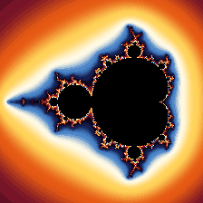

*Down Seahorse Valley to a copy of the whole set, 10¹⁵ times smaller, and round again.*

## The garden

<table>
<tr>
<td>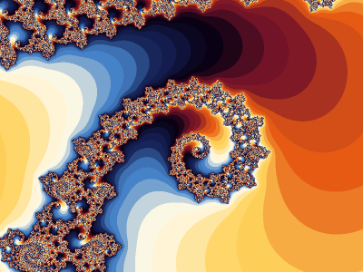<br><sub>Seahorse Valley</sub></td>
<td>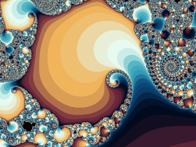<br><sub>Elephant Valley</sub></td>
<td>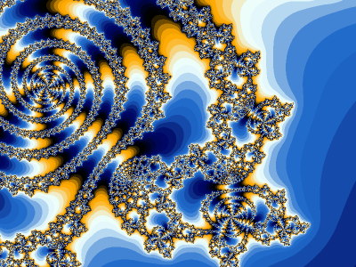<br><sub>Triple spiral</sub></td>
</tr>
<tr>
<td>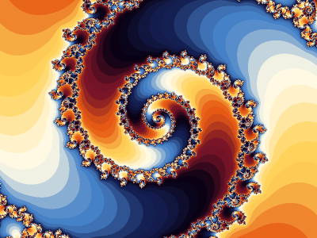<br><sub>An endless spiral, 10⁸×</sub></td>
<td>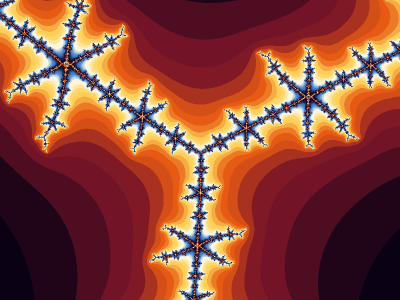<br><sub>Star</sub></td>
<td>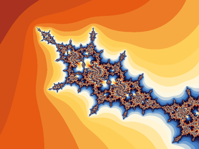<br><sub>Tendrils</sub></td>
</tr>
<tr>
<td>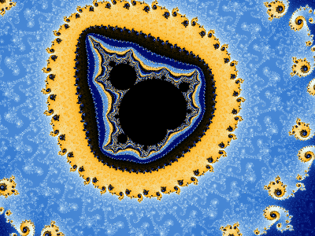<br><sub>A minibrot, 10¹⁵×</sub></td>
<td>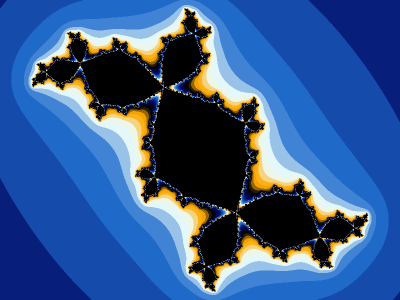<br><sub>Julia: Douady's rabbit</sub></td>
<td>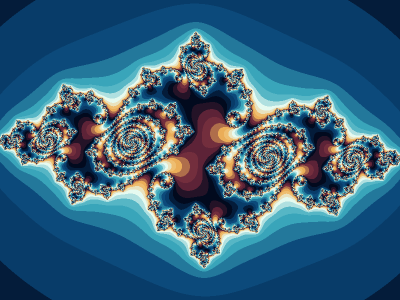<br><sub>Julia: spirals</sub></td>
</tr>
<tr>
<td>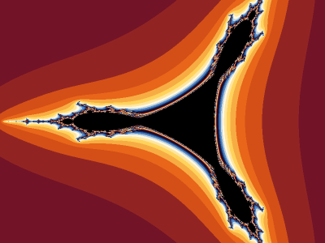<br><sub>Tricorn</sub></td>
<td>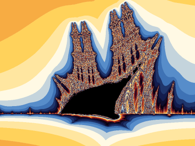<br><sub>Burning Ship: the armada</sub></td>
<td>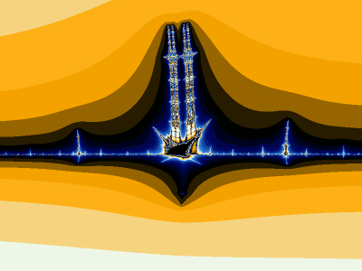<br><sub>Burning Ship: a lone ship</sub></td>
</tr>
</table>

## Walk in

```bash
pip install -e ".[viewer,gif]"
python -m fractals view          # scroll to zoom, drag to move, 1–4 to change fractal
```

`--gpu` renders on the graphics card. `python -m fractals render` saves a
picture, and `python -m fractals zoom` saves a zoom animation; the garden and
the animation above come from [`examples/`](examples).

The original renderers are in [`examples/original/`](examples/original).
