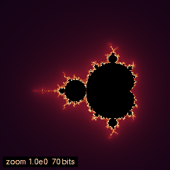
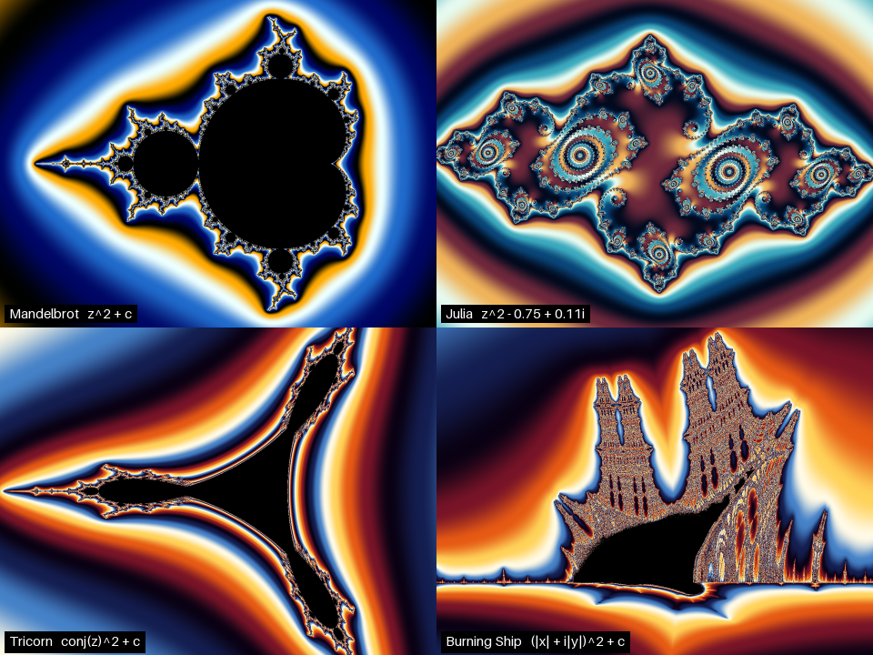
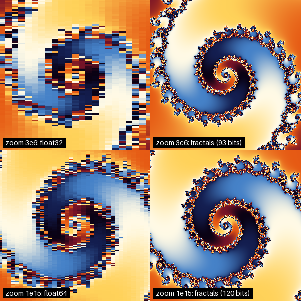
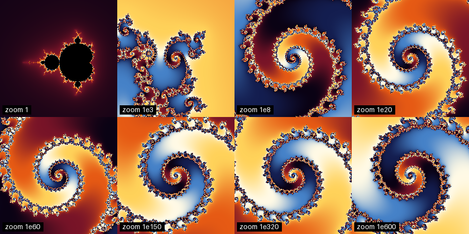

# Fractals

Escape-time fractals at **any zoom depth**. The view centre and a single
reference orbit are computed in arbitrary precision; every pixel is then
iterated in float64 as a *perturbation* of that orbit, which is exact enough
at 1e30, 1e300 or 1e600 as it is at 1.



*From the whole set to 10²⁷× magnification (13 orders of magnitude past the
point where float64 dissolves into blocks) without a glitch. The target is a
Misiurewicz point computed by Newton's method to as many digits as the zoom
needs, so it sits exactly on the boundary and new structure keeps appearing at
every scale. The label shows the working precision growing from 70 to 160
bits. Rendered by [`examples/deep_zoom_gif.py`](examples/deep_zoom_gif.py).*

---

## Quick start

```bash
python3 -m venv .venv
source .venv/bin/activate
python -m pip install --upgrade pip
python -m pip install -e ".[viewer,gif]"      # or: pip install -r requirements.txt && pip install -e .

python -m fractals view                        # interactive deep-zoom window
```

Viewer controls:

| Input | Action |
| --- | --- |
| mouse wheel | zoom toward the pointer (no depth limit) |
| left drag | pan |
| `1` `2` `3` `4` | Mandelbrot, Julia, Tricorn, Burning Ship |
| `+` / `-` | more / fewer iterations |
| `P` | next palette |
| `S` | save a PNG of the current view |
| `C` | print the exact coordinates of the view |
| `R` | back to the home view |
| `Esc` | quit |

While you zoom or drag, the last image is scaled and moved as a preview, and it
is re-rendered exactly once you pause. The first render includes Numba's
compilation time (cached after that).

### From the command line

```bash
# One image, 10^60× deep: coordinates are strings, so every digit is kept
python -m fractals render mandelbrot --radius 1e-60 --supersample 2 -o deep.png \
    --re -0.77568376800905379746948350393474104572824650461580039479495200 \
    --im  0.13646736829469012473327440961784876519777211159246769640780020

# A zoom GIF onto an exact landmark (computed to the digits the depth needs)
python -m fractals zoom --target spiral --depth 1e100 --frames 300 -o zoom.gif

# The other families
python -m fractals render burning_ship --re -1.7621 --im -0.029 --radius 0.05 -o ship.png
python -m fractals render julia --c -0.123 0.745 -o rabbit.png
```

### From Python

```python
import fractals as fr

re, im = fr.targets.landmark("spiral", digits=120)       # exact, 120 digits
view = fr.Viewport(re, im, radius="1e-100", width=800, height=600)

img = fr.render("mandelbrot", view, supersample=2)        # (600, 800, 3) uint8
mu  = fr.escape_time("mandelbrot", view, max_iter=20000)  # smooth iteration counts

view = view.zoom("1e50", about=(200, 150))                # keep pixel (200,150) fixed
view = view.pan(-40, 12)                                  # drag by pixels
print(view.describe())                                    # coordinates, zoom, bits
```

---

## The catalogue



| Name | Map | Pixel is | Notes |
| --- | --- | --- | --- |
| `mandelbrot` | `z → z² + c` | `c` | the reference; exact zoom targets in `fractals.targets` |
| `julia` | `z → z² + k` | `z₀` | `Julia(c=("-0.75", "0.11"))`, any `k` |
| `tricorn` | `z → conj(z)² + c` | `c` | the Mandelbar set; anti-holomorphic, three-fold symmetric |
| `burning_ship` | `z → (\|Re z\| + i\|Im z\|)² + c` | `c` | drawn with the imaginary axis pointing down, by convention |

All four zoom without limit: each one has its exact map (for the reference
orbit) and its perturbation formula (for the pixels). For the Burning Ship,
that means differencing absolute values without cancellation.

---

## How infinite zoom works

A float64 has 53 significant bits. Once neighbouring pixels differ by less than
that, around 10¹⁴× for a whole-set view, they collapse into the same number and
the image turns to blocks. A float32 GLSL shader gets there by about 10⁶×:



The library avoids the problem instead of carrying more digits per pixel:

1. **Positions are exact.** A `Viewport` keeps its centre and radius as
   `decimal.Decimal`, and every zoom or pan is done at the precision that
   depth needs (`view.bits`: about 3.3 bits per decade, plus guard bits).
2. **One orbit, in arbitrary precision.** The centre's orbit `Zₙ` is iterated
   once in fixed-point Python integers ([`render.py`](src/fractals/render.py)).
3. **Every pixel as a difference.** Each pixel iterates only `δₙ = zₙ − Zₙ`,
   e.g. `δₙ₊₁ = 2Zₙδₙ + δₙ² + δc` for `z² + c`. `δ` only needs to be accurate
   *relative to itself*, so float64 suffices at any depth. The Numba kernel is
   [`kernel.py`](src/fractals/kernel.py).
4. **Glitch-free by rebasing.** When a pixel comes closer to 0 than to the
   reference (`|zₙ| < |δₙ|`), or the reference orbit ends, the pixel restarts
   from the beginning of the reference with `δ ← zₙ`. That is Zhuoran's
   method, and it avoids the need for secondary references.
5. **Past float64's exponent range.** Beyond ~1e300 a pixel offset underflows
   float64 itself, so while `δ` is that small it is carried as a mantissa plus
   an integer exponent and renormalised as it grows.

The tests check steps 2–5 against **direct iteration in exact big-integer
arithmetic**, pixel by pixel, for all four fractals at 10²⁰× and 10⁶⁰×, and
for the Mandelbrot set at 10⁴⁰⁰×. Here is one point, far past the float64
exponent limit:



*The same spiral at 10⁰ … 10⁶⁰⁰×. Around a Misiurewicz point the set is
asymptotically self-similar, so the zoom never runs out of detail. The last
panel needs 2063 bits for its centre.*

### Exact zoom targets

A deep zoom is only as good as its target: a centre that is off the boundary by
1e-20 looks fine down to 1e20× and then turns into a flat colour.
[`fractals.targets`](src/fractals/targets.py) solves for points with a
closed definition, by Newton's method in fixed point, to any number of digits:

```python
from fractals.targets import misiurewicz, nucleus, preperiod_period, landmark

re, im = misiurewicz("-0.77568377", "0.13646737", preperiod=24, period=1, digits=500)
preperiod_period(re, im)                  # (24, 1)
re, im = nucleus("-1.75", "0", period=3)  # centre of the period-3 minibrot
re, im = landmark("spiral", digits=1000)  # named places: spiral, antenna, dendrite
```

---

## Library layout

The package is ordered by what each thing *is*, from numbers up to pixels:

| Module | Holds | Key names |
| --- | --- | --- |
| [`precision.py`](src/fractals/precision.py) | arbitrary-precision numbers and the bridge to float64 | `to_decimal`, `to_fixed`, `fixed_to_float`, `FloatExp` |
| [`families.py`](src/fractals/families.py) | the catalogue: what each fractal iterates | `Mandelbrot`, `Julia`, `Tricorn`, `BurningShip`, `CATALOG`, `get` |
| [`view.py`](src/fractals/view.py) | the camera: a window onto the plane, at any depth | `Viewport` (`.zoom`, `.pan`, `.point`, `.bits`) |
| [`kernel.py`](src/fractals/kernel.py) | perturbation iteration (Numba, parallel) | `perturbation_kernel` |
| [`render.py`](src/fractals/render.py) | fractal + view → escape data → image | `reference_orbit`, `escape_time`, `render`, `auto_iterations` |
| [`color.py`](src/fractals/color.py) | escape data → RGB | `colorize`, `PALETTES` |
| [`targets.py`](src/fractals/targets.py) | exact zoom targets | `misiurewicz`, `nucleus`, `landmark` |
| [`zoom.py`](src/fractals/zoom.py) | zoom paths, frame sequences, GIFs | `ZoomPath`, `zoom_frames`, `save_gif` |
| [`viewer.py`](src/fractals/viewer.py) | interactive window (VisPy); logic in a GUI-free `Navigator` | `run`, `Navigator` |
| [`__main__.py`](src/fractals/__main__.py) | the command line | `view`, `render`, `zoom` |

To add a fractal, subclass `Fractal` in `families.py` with its exact map
(`step_fixed`), and if it is not one of the three existing kernels, add its
perturbation step to `kernel._step`. Nothing else knows which fractal it is
drawing.

```text
.
├── src/fractals/             the library (above)
├── examples/
│   ├── deep_zoom_gif.py      the GIF at the top of this page
│   ├── gallery.py            gallery.png, depths.png, precision.png
│   └── float_baselines/      the original fixed-precision renderers, for comparison
│       ├── gpu_glsl_float32.py
│       ├── cpu_numba_float64.py
│       └── cpu_numpy_float64.py
├── tests/                    perturbation vs exact big-int iteration, views, targets
├── docs/                     figures
├── pyproject.toml
└── requirements.txt
```

## Float baselines

The original three renderers are kept in
[`examples/float_baselines/`](examples/float_baselines) to compare approaches
side by side. They are fast and simple, and they stop at the precision of their
number type:

```bash
python examples/float_baselines/gpu_glsl_float32.py   # GLSL, float32 — breaks near 1e6×
python examples/float_baselines/cpu_numba_float64.py  # Numba, float64 — breaks near 1e14×
python examples/float_baselines/cpu_numpy_float64.py  # NumPy, float64, static image
```

## Tests

```bash
pip install -e ".[dev]"
python -m pytest            # 27 tests, a few seconds after the first JIT compile
```

The render tests compare the perturbation kernel with independent direct
iteration: float64 for shallow views, and exact fixed-point integers pixel by
pixel for deep ones (10²⁰×, 10⁶⁰× and 10⁴⁰⁰×). Pixels whose orbit is
chaotic (the answer changes if the pixel moves by 10⁻⁹ of its width) are
excluded, since no finite precision agrees there.

## Limitations

- **Iterations grow with depth.** Near the boundary, escape takes more
  iterations the deeper you go, roughly linearly in the number of decades
  (`auto_iterations` budgets 120 per decade). Series approximation and
  bilinear approximation, which skip most of those iterations, are not
  implemented yet. A 240×240 frame at 10³²⁰× takes ~6 s on 4 cores.
- **CPU only.** The perturbation kernel runs in Numba across CPU cores; the GPU
  path is the float32 baseline.
- **Chaotic regions.** Where orbits are chaotic (parts of the Burning Ship,
  the Mandelbrot antenna), individual pixels are not reproducible by *any*
  finite precision. The picture is right statistically, not pixel by pixel.
- **The viewer renders synchronously.** A very deep, high-iteration view
  blocks the window for the length of one render.
